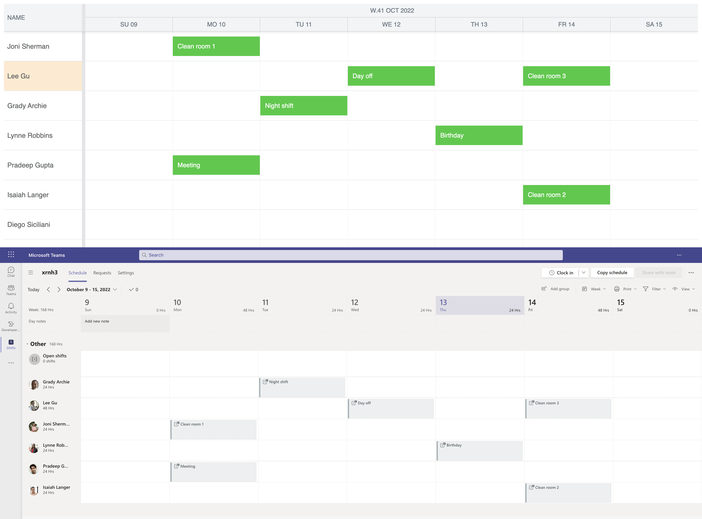
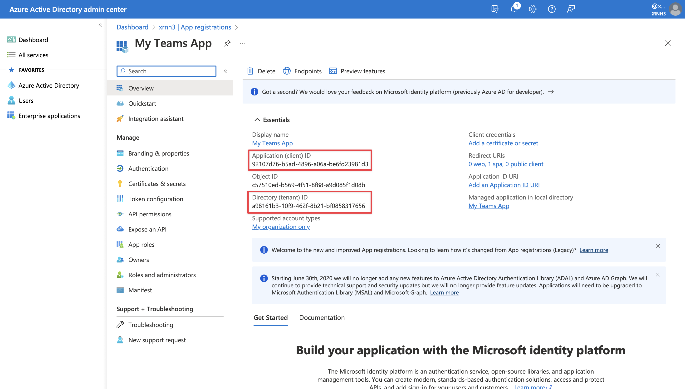
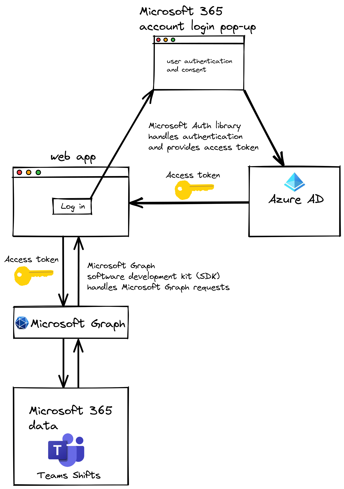
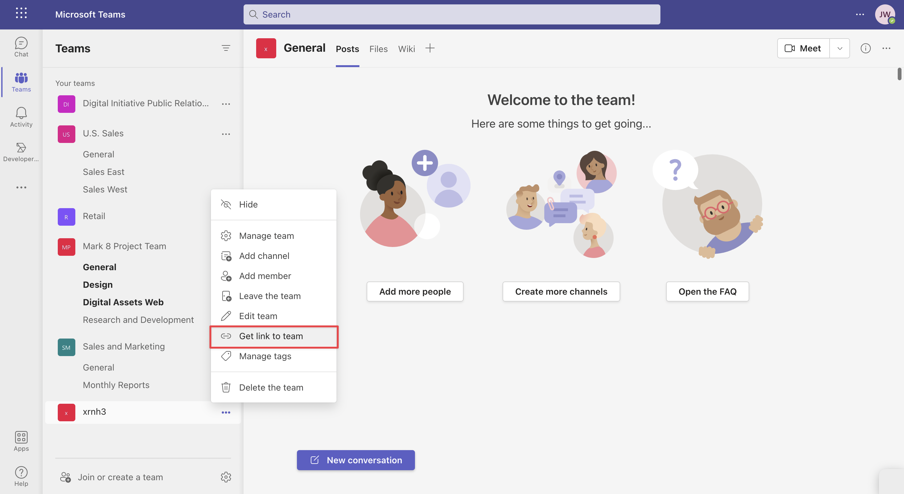

# How to connect and sync Bryntum Scheduler to a Microsoft Teams 

[Bryntum Scheduler](https://www.bryntum.com/products/scheduler/) is a modern and high performance scheduling UI component built with pure Javascript. It can easily be used with React, Vue, or Angular. In this tutorial, we'll connect and sync a Bryntum Scheduler to Microsoft Teams. We'll do the following:

- Create a JavaScript app that a user can log in to using their Microsoft 365 Developer Program account. 
- Use Microsoft Graph to get the user's Microsoft Teams shifts
- Display the Microsoft Teams shifts in a Bryntum Scheduler. 
- Sync event changes in the Bryntum Scheduler with the user's Microsoft Teams. 



## Getting started

Clone the [starter GitHub repository](https://github.com/ritza-co/bryntum-teams-scheduler-app-starter). The starter repository uses [Vite](https://vitejs.dev/), which is a development server and JavaScript bundler. You'll need Node.js version 14.18+ for Vite to work.

Now install the Vite dev dependency by running the following command:

```bash
npm install
```

Run the local dev server using `npm run dev` and you’ll see a blank page. The dev server is configured to run on `http://localhost:8080/` in the `vite.config.js` file. This will be needed for Microsoft 365 authentication later.

Let’s create our Bryntum Scheduler now.

## Creating a scheduler using Bryntum

We'll install the Bryntum Scheduler component using npm. Follow step one of the Bryntum Scheduler set-up guide [here](https://www.bryntum.com/docs/scheduler/guide/Scheduler/quick-start/javascript-npm#step-1---access-to-npm-registry) to login to the Bryntum registry component.

Then initialize your application using the npm CLI `npm init` command:

```
npm init
```

You with get a series of questions in the terminal, accept all the defaults by clicking `enter` for each question.

Now follow step four of the Bryntum Scheduler [set-up guide](https://www.bryntum.com/docs/scheduler/guide/Scheduler/quick-start/javascript-npm#step-1---access-to-npm-registry) to install the Bryntum Scheduler.

Let’s import the Bryntum Scheduler component and give it some basic configuration. In the `main.js` file add the following lines:

```js
import { Scheduler } from './node_modules/@bryntum/scheduler/scheduler.module.js';
import "@bryntum/scheduler/scheduler.stockholm.css";

// get the current date
var today = new Date();

// get the day of the week
var day = today.getDay();

// get the date of the previous sunday
var previousSunday = new Date(today);
previousSunday.setDate(today.getDate() - day);

// get the date of the following Saturday
var nextSaturday = new Date(today);
nextSaturday.setDate(today.getDate() + (6 - day));

const scheduler = new Scheduler({
    appendTo : "scheduler",

    startDate : previousSunday,
    endDate   : nextSaturday,
    viewPreset : 'dayAndWeek',

    resources : [
        { id : 1, name : 'Dan Stevenson' },
        { id : 2, name : 'Talisha Babin' }
    ],

    events : [
        { resourceId : 1, startDate : dateNow, endDate : dateNextWeek },
        { resourceId : 2, startDate : dateNow, endDate : dateNextWeek }
    ],

    columns : [
        { text : 'Name', field : 'name', width : 160 }
    ]
});
```

We imported the Bryntum Scheduler and the CSS for the Stockholm theme, which is one of five available themes. You can also create custom themes. You can read more about styling the scheduler [here](https://bryntum.com/docs/scheduler/guide/Scheduler/customization/styling). We created a new Bryntum Scheduler instance and passed a configuration object into it. We added the scheduler to the DOM as a child of the `<div>` element with an `id` of `"scheduler"`. 

The Scheduler can be set up to display specifc dates on opening, here we set the `startDate` to the previous Sunday and `endDate` to the following Saturday in order to reflect the dates in the Microsoft Teams UI.

We passed in data inline to populate the Scheduler resources and events stores for simplicity. You can learn more about working with data in the [Bryntum docs](https://www.bryntum.com/docs/scheduler/guide/Scheduler/data/displayingdata). We have a resource for two individuals. Within the scheduler, there's an example `"shift"` event for each individual that runs for a week. If you run your dev server now, you'll see the events in the Bryntum Scheduler:


Now let's learn how to retrieve a list of team shifts from a user’s Microsoft Teams using Microsoft Graph.

## Getting access to Microsoft Graph

We're going to register a Microsoft 365 application by creating an application registration in [Azure Active Directory](https://azure.microsoft.com/en-us/products/active-directory/) (Azure AD), which is an authentication service. We'll do this so that a user can sign in to our app using their Microsoft 365 account. This will allow our app access to the data the user gives the app permission to access. A user will sign in using OAuth, which will send an access token to our app that will be stored in session storage. We'll then use the token to make authorized requests for Microsoft 365 Teams data using Microsoft Graph. Microsoft Graph is a single endpoint REST API that enables you to access data from Microsoft 365 applications. 

To use Microsoft Graph you'll need a [Microsoft account](https://account.microsoft.com/account?lang=en-hk) and you'll need to join the [Microsoft 365 Developer Program](https://developer.microsoft.com/en-us/microsoft-365/dev-program) with that Microsoft account. When joining the Microsoft 365 Developer Program, you'll be asked what areas of Microsoft 365 development you’re interested in, select the Microsoft Graph option. Choose the closest data center region, create your admin username and password, then click "Continue". Next, select “Instant Sandbox” and click “Next”. 


Now that you have successfully joined the developer program, you can get your administrator’s email address in the dashboard window. We'll use it to create an application with Microsoft Azure.


## Creating an Azure AD app to connect to Microsoft 365

Let's register a Microsoft 365 application by creating an application registration in the [Azure Active Directory admin portal](https://aad.portal.azure.com/). Sign in using the admin email address from your Microsoft 365 Developer Program account. Now follow these steps to create an Azure Active Directory application:

1. In the menu, select "Azure Active Directory".


2.  Select "App registrations".


3.  Click "New registration" to create a new app registration.


4. Give your app a name, select the "Single tenant" option, select "Single page application" for the redirect URI, and enter http://localhost:8080 for the redirect URL. Then click the "Register" button.


After registering your application, take note of the Application (client) ID and the Directory (tenant) ID, you'll need these to set up authentication for your web app later.




Now we can create a JavaScript web app that can get user data using the Microsoft Graph API. The next step is to set up authentication within our web app.


## Setting up Microsoft 365 authentication in the JavaScript app

To get data using the Microsoft Graph REST API, our app needs to prove that we're the owners of the app that we just created in Azure AD. Your application will get an access token from Azure AD and include it in each request to Microsoft Graph. After this is set up, users will be able to sign in to your app using their Microsoft 365 account. This means that you won’t have to implement authentication in your app or maintain users' credentials.



First we'll create the variables and functions we need for authentication and retrieving team shifts from Microsoft Teams. Then we'll add the Microsoft Authentication Library and Microsoft Graph SDK, which we'll need for authentication and using Microsoft Graph. 

Create a file called `auth.js` in your project’s root directory and add the following code:

```js
const msalConfig = {
  auth: {
    clientId: "<your-client-ID-here>",
    // comment out if you use a multi-tenant AAD app
    authority: "https://login.microsoftonline.com/<your-directory-ID-here>",
    redirectUri: "http://localhost:8080",
  },
}; 
```

In the `msalConfig` variable, replace the value for `clientID` with the client ID that came with your Azure AD application and replace the `authority` value with your directory ID.

The following code will check permissions, create a Microsoft Authentication Library client, log a user in, and get the authentication token. Add it to the bottom of the file.

```js
const msalRequest = { scopes: [] };
function ensureScope(scope) {
  if (
    !msalRequest.scopes.some((s) => s.toLowerCase() === scope.toLowerCase())
  ) {
    msalRequest.scopes.push(scope);
  }
}

// Initialize MSAL client
const msalClient = new msal.PublicClientApplication(msalConfig);

// Log the user in
async function signIn() {
  const authResult = await msalClient.loginPopup(msalRequest);
  sessionStorage.setItem("msalAccount", authResult.account.username);
}

async function getToken() {
  let account = sessionStorage.getItem("msalAccount");
  if (!account) {
    throw new Error(
      "User info cleared from session. Please sign out and sign in again."
    );
  }
  try {
    // First, attempt to get the token silently
    const silentRequest = {
      scopes: msalRequest.scopes,
      account: msalClient.getAccountByUsername(account),
    };

    const silentResult = await msalClient.acquireTokenSilent(silentRequest);
    return silentResult.accessToken;
  } catch (silentError) {
    // If silent requests fails with InteractionRequiredAuthError,
    // attempt to get the token interactively
    if (silentError instanceof msal.InteractionRequiredAuthError) {
      const interactiveResult = await msalClient.acquireTokenPopup(msalRequest);
      return interactiveResult.accessToken;
    } else {
      throw silentError;
    }
  }
}
```


The `msalRequest` variable stores the current Microsoft Authentication Library request. It initially contains an empty array of scopes. The list of permissions granted to your app is part of the access token. These are the scopes of the [OAuth](https://oauth.net/) standard. When your app requests an access token from the Azure Active Directory, it needs to include a list of scopes. Each operation in Microsoft Graph has its own list of scopes. The list of the permissions required for each operation is available in the [Microsoft Graph permissions reference](https://learn.microsoft.com/en-us/graph/permissions-reference).


## Using Microsoft Graph to access a user's Teams shifts

Create a file called `graph.js` in the project’s root directory and add the following code:

```js
const userTimeZone = Intl.DateTimeFormat().resolvedOptions().timeZone;

// Create an authentication provider
const authProvider = {
    getAccessToken: async () => {
        // Call getToken in auth.js
        return await getToken();
    }
};
// Initialize the Graph client
const graphClient = MicrosoftGraph.Client.initWithMiddleware({ authProvider });


async function getMembers() {
    ensureScope("TeamMember.Read.All");
    return await graphClient
    .api('/teams/<your-team-ID-here>/members')
    .get();
}

async function getAllShifts() {
    ensureScope("Schedule.Read.All");
    return await graphClient
    .api('/teams/<your-team-ID-here>/schedule/shifts')
    .header("Prefer", `outlook.timezone="${userTimeZone}"`)
    .get();
}
```


We get the access token using the `getToken` method in the `auth.js` file. We then use the Microsoft Graph SDK (which we'll add later) to create a Microsoft Graph client that will handle Microsoft Graph API requests.

The `getMembers` function retrieves the team members from the team specified by a team ID. Find your team ID by navigating to your Microsoft Teams and copying the link from your team.





The team ID can be found in the link after `groupid=` and the first `&`.


The `getAllShifts` function receives all the shifts within the team specified by the same ID. Make sure to replace `<your-team-ID-here>` in the code aboce with your team ID.


We use the `ensureScope` function to specify the permissions needed to access the team shifts data. We then call the `"/teams/"` endpoint using the `graphClient` API  method to get the data from Microsoft Graph. The `header` method allows us to set our preferred time zone. Teams shifts dates are stored using UTC. We need to set the time zone for the returned Teams shifts start and end dates. This is done so that the correct event times are displayed in our Bryntum Scheduler. The value for the `userTimeZone` is defined in the first line of the code above.


Now let's add the user's Teams shifts to our Bryntum Scheduler. 


## Adding the Microsoft Teams shifts to Bryntum Scheduler

Let's add the Microsoft 365 sign in link and import the Microsoft Authentication Library and Microsoft Graph SDK. In the `index.html` file, replace the child elements of the `<body>` HTML element with the following elements:

```html
  <main id="main-container" role="main" class="container">
    <div id="content" style="display: none">
      <div id="scheduler"></div>
    </div>
    <a id="signin" href="#">
      
    </a>
  </main>
  <script src="https://alcdn.msauth.net/browser/2.1.0/js/msal-browser.min.js"
    integrity="sha384-EmYPwkfj+VVmL1brMS1h6jUztl4QMS8Qq8xlZNgIT/luzg7MAzDVrRa2JxbNmk/e"
    crossorigin="anonymous"></script>
  <script src="https://cdn.jsdelivr.net/npm/@microsoft/microsoft-graph-client/lib/graph-js-sdk.js"></script>
  <script src="auth.js"></script>
  <script src="graph.js"></script>
  <script type = "module" src = "main.js"></script>
```


Initially, our app will display the sign-in link only. When a user signs in, the Bryntum Scheduler will be displayed. 

In the `main.js` file, add the following line to store the "Sign in with Microsoft" link element object in a variable:

```js
const signInButton = document.getElementById("signin");
```


Now add the following function at the bottom of the file:

```js
async function displayUI() {
    await signIn();
  
    // Hide login button and initial UI
    var signInButton = document.getElementById("signin");
    signInButton.style = "display: none";
    var content = document.getElementById("content");
    content.style = "display: block";
  
    var events = await getAllShifts();
    var members = await getMembers();
    members.value.forEach((member) => {
        var user = {id: member.userId, name: member.displayName};
        // append user to resources list
        scheduler.resourceStore.add(user);
    });
    events.value.forEach((event) => {
        var shift = {resourceId: event.userId, name: event.sharedShift.displayName, startDate: event.sharedShift.startDateTime, endDate: event.sharedShift.endDateTime};
        // append shift to events list
        scheduler.eventStore.add(shift);
    });
  }

signInButton.addEventListener("click", displayUI);
export { displayUI };
```


The `displayUI` function calls the `signIn` function in `auth.js` to sign the user in. Once the user is signed in, the sign-in link is hidden and the Bryntum Scheduler is displayed. We use the `getAllShifts` function in the `graph.js` file to get the team shifts. We then use the retrieved Teams shifts to create events for the Bryntum Scheduler and add them to the `scheduler.eventStore` store.

Similarly we use the `getMembers` function to get the team members and populate the `scheduler.resourceStore` with the team members.

We no longer need the in-line data we created in the initial set-up of our Scheduler, remove these lines of code from the `scheduler` we defined in `main.js`.

```js
    resources : [
        { id : 1, name : 'Dan Stevenson' },
        { id : 2, name : 'Talisha Babin' }
    ],

    events : [
        { resourceId : 1, startDate : previousSunday, endDate : nextSaturday },
        { resourceId : 2, startDate : previousSunday, endDate : nextSaturday }
    ],
```

Now sign in to [Microsoft Teams](https://www.microsoft.com/en-ww/microsoft-teams/log-in) using the admin email address from your Microsoft 365 Developer Program account and create some events for the following week:


Run your dev server using `npm run dev` and you'll see the sign-in link:


Sign in with the same admin email address that you used to log in to Microsoft Teams:


You'll now see your Teams Shifts in your Bryntum Scheduler:


Next, we'll sync Teams with the scheduler by implementing CRUD functionality in our Bryntum Scheduler. Updates to the Bryntum Scheduler will update the shifts in Microsoft Teams.


## Implementing CRUD

Now that we have connected our scheduler to the Graph API, we'll implement the rest of the CRUD functionality by taking advantage of Microsoft Graph's `post`, `patch`, and `delete` methods, passing a query string where relevant.

### Create events

In the `graph.js` file, add the following lines:

```js
async function createShift(name, start, end, userId) {
    ensureScope("Schedule.ReadWrite.All");
    return await graphClient
    .api('/teams/b35b8ba3-97e5-4f2e-803f-4926ac37a5ac/schedule/shifts')
    .post({
        "userId": userId,
        "sharedShift": {
            "displayName": name,
            "startDateTime": start,
            "endDateTime": end
        }
    });
}
```


Here we create a function that will create an Teams shift with a user ID, name, start date, and end date collected from the Bryntum Scheduler. The function is passed the appropriate scope and the new shift data is defined. 


### Update events

In the `graph.js` file, add the following function:

```js
async function updateShift(id, userId, name, start, end) {
    ensureScope("Schedule.ReadWrite.All");
    return await graphClient
    .api(`/teams/b35b8ba3-97e5-4f2e-803f-4926ac37a5ac/schedule/shifts/${id}`)
    .put({
        "userId": userId,
        "sharedShift": {
            "displayName": name,
            "startDateTime": start,
            "endDateTime": end
        }
    });
}
```


The `updateShift` function will identify the appropriate Teams shift by `id`, and then it will use the new user ID, name, start date, and end date from the Bryntum Calendar to update the event. The function is passed the appropriate scope, and the new shift data is defined.


### Delete events

In the `graph.js` file, add the following function:

```js
async function deleteShift(id) {
    ensureScope("Schedule.ReadWrite.All");
    return await graphClient
    .api(`/teams/b35b8ba3-97e5-4f2e-803f-4926ac37a5ac/schedule/shifts/${id}`)
    .delete();
}
```


The `deleteShift` function will identify the appropriate Teams shift by `id`, and delete the event.


### Listening for event data changes in the Bryntum Scheduler

Next, we'll set the listeners for our Bryntum Scheduler so that it will know when the user updates the scheduler events.

Replace the definition of `scheduler` with the following code:

```js
const scheduler = new Scheduler({
    appendTo : "scheduler",

    startDate : previousSunday,
    endDate   : nextSaturday,
    viewPreset : 'dayAndWeek',

    listeners : {
        dataChange: function (event) {
            updateMicrosoft(event);
          }},

    columns : [
        { text : 'Name', field : 'name', width : 160 }
    ]
});
```


Here we set a listener on our Bryntum Scheduler to listen for any changes to the Bryntum Scheduler's data store. This will fire an event called `"update"` whenever a calendar event is created or updated, and an event called `"remove"` whenever an event is deleted.

The event that's retrieved from the `dataChange` listener will also carry event data about the specific scheduler event that has been altered. We'll use the event data to identify which event is being altered and what's being changed.


Next we'll create a function called `updateMicrosoft` that will update Teams when the appropriate `"update"` or `"delete"` event is fired.

Add the following code below the definition of `scheduler` in the `main.js` file:

```js
async function updateMicrosoft(event) {
    if (event.action == "update") {
        var microsoftShifts = await getAllShifts();

        // check if shift exists in microsoft, if it does, update it, if not, create it
        var eventExists = false;

        if ("name" in event.changes || "startDate" in event.changes || "endDate" in event.changes || "resourceId" in event.changes) {
            for (var i = 0; i < microsoftShifts.value.length; i++) {

                const shift = microsoftShifts.value[i];
                var shiftName = shift.sharedShift.displayName;

                if ("name" in event.changes) {
                    if (event.changes.name.oldValue == shiftName) {
                        eventExists = true;
                        updateShift(shiftId, event.record.resourceId, event.record.name, event.record.startDate, event.record.endDate);
                        return;
                    }
                } else if (event.record.name == shiftName) {
                    eventExists = true;
                    updateShift(shiftId, event.record.resourceId, event.record.name, event.record.startDate, event.record.endDate);
                    return;
                }
            }
        } 
        if (eventExists == false && event.record.originalData.name == "New event") {
            createShift(event.record.name, event.record.startDate, event.record.endDate, event.record.resourceId);
            }
        } else if (event.action == "remove" && "name" in event.records[0].data) {
            const microsoftShifts = await getAllShifts();
            var shiftName = event.records[0].data.name;
            for (var i = 0; i < microsoftShifts.value.length; i++) {
                if (microsoftShifts.value[i].sharedShift.displayName == shiftName) {
                    deleteShift(microsoftShifts.value[i].id);
                    return;
                }
            }
        }
}
```


Here we create a function that is called on all changes to the data store of the Bryntum Scheduler. The function then calls one of the Microsoft Graph CRUD functions that we defined.

On `"update"` we call `getAllShifts` to get a list of all the user's Teams events. We then loop through this list and compare the Bryntum Scheduler event data from the `"update"` event to the Teams shifts.

```js
async function updateMicrosoft(event) {
    if (event.action == "update") {
        var microsoftShifts = await getAllShifts();

        // check if shift exists in microsoft, if it does, update it, if not, create it
        var eventExists = false;

        if ("name" in event.changes || "startDate" in event.changes || "endDate" in event.changes || "resourceId" in event.changes) {
            for (var i = 0; i < microsoftShifts.value.length; i++) {
```


If the name has been changed in the update, we need to check if any of the Teams shift names match the name found in the "oldValue" of the `update` data. This `oldValue` data represents the name before the change made by `update`.

If a Teams shift name matches the name in the `oldValue`, then that Teams shift needs to be updated to match the name.

```js
  const shift = microsoftShifts.value[i];
  var shiftName = shift.sharedShift.displayName;

  if ("name" in event.changes) {
      if (event.changes.name.oldValue == shiftName) {
          eventExists = true;
          updateShift(shiftId, event.record.resourceId, event.record.name, event.record.startDate, event.record.endDate);
          return;
      }
  } 
```


If there are events that match by name, then that Teams shift needs to be updated.


```js
else if (event.record.name == shiftName) {
      eventExists = true;
      updateShift(shiftId, event.record.resourceId, event.record.name, event.record.startDate, event.record.endDate);
      return;
  }
```


If the event does not exist, we check if the `originalData.name` data is `"New event"`, this confirms that this update is the creation of a new event.

```js
  if (eventExists == false && event.record.originalData.name == "New event") {
      createShift(event.record.name, event.record.startDate, event.record.endDate, event.record.resourceId);
      }
```


Finally, if the `dataChange` event is a `"remove"` event, then we delete the matching Teams event using the `deleteShift` function.

```js
else if (event.action == "remove" && "name" in event.records[0].data) {
            const microsoftShifts = await getAllShifts();
            var shiftName = event.records[0].data.name;
            for (var i = 0; i < microsoftShifts.value.length; i++) {
                if (microsoftShifts.value[i].sharedShift.displayName == shiftName) {
                    deleteShift(microsoftShifts.value[i].id);
                    return;
                }
            }
        }
```


Now try to create, update, delete, and edit an event in the Bryntum Calendar. You'll see the changes reflected in the Outlook Calendar.


## Next steps

This tutorial gives you a starting point for creating a Bryntum Scheduler using vanilla JavaScript and syncing it with Microsoft Teams. There are many ways that you can improve the Bryntum Scheduler. For example, you can add features such as [resource grouping](https://bryntum.com/examples/scheduler/grouping/). Take a look at our [Scheduler demos page](https://bryntum.com/examples/scheduler/) to see demos of the available features.
